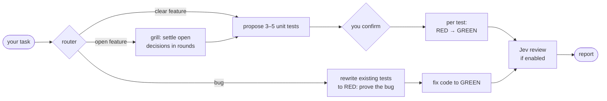

<div align="center">

# lexi

### Your coding agent writes the test first. Every time.

lexi reads the task, proposes unit tests, waits for your OK, then drives **RED → GREEN**.<br>
No spec documents, nothing to clean up: the tests are the spec, and they stay in the repo.

[](#quick-start-claude-code)
[](#quick-start-pi)
[](LICENSE)

[Quick start](#quick-start-claude-code) · [How it works](#how-it-works) · [The guard](#the-guard) · [Commands](#commands) · [Examples](#examples)

</div>

---

## Why lexi

Agents say they do TDD. Then they write the code, write a test that matches it, and bend the assertion
until it goes green. lexi makes that impossible, not just discouraged.

|  |  |
|---|---|
| 🧪 **Test first, mechanically** | A guard blocks any edit to a source file whose test does not exist yet. |
| 🔒 **No bending tests to green** | Rewriting a committed assertion is blocked. Appending new tests is always fine. |
| 🧭 **Right flow for the task** | Bug, clear feature or open feature: the router picks the path, you confirm the tests. |
| ✂️ **Minimal GREEN** | [ponytail](https://github.com/DietrichGebert/ponytail) keeps every implementation step as small as it can be. |
| 🔁 **Two runtimes, one flow** | Same skills and same guard on **Claude Code** and **Pi** (`@earendil-works/pi-coding-agent`). |
| 🤖 **Optional review with [jev](jev/README.md)** | Picks model and effort per session, compacts context verbatim, and reviews the diff after the last GREEN with a verdict computed in code. Off until `init` turns it on. |

### What it looks like

```text
/lexi:lexi in src/domain/discount.js add applyDiscount(total, pct) capped at 50%

  Proposed tests:
    1. applies a 10% discount to total
    2. caps discount at 50% of total
    3. rejects a negative percentage
  Confirm or add?  › ok

  test 1  RED ✗  →  GREEN ✓
  test 2  RED ✗  →  GREEN ✓
  test 3  RED ✗  →  GREEN ✓

  Report: 3 tests, 1 file touched, no untested code.
```

And when the agent tries to skip ahead:

```text
lexi — write to `src/domain/discount.js` BLOCKED.
`src/domain/discount.js` is under `testable` and mirror test does not exist:
  tests/domain/discount.test.js
```

---

## Quick start: Claude Code

**The fast way.** Open `claude` in your project and paste this prompt. It installs the full suite
(lexi, jev, ponytail, caveman) and prepares the Jev key:

```text
Install the lexi suite for Claude Code. Run these shell commands, stopping on the first failure:

  claude plugin marketplace add DietrichGebert/ponytail
  claude plugin marketplace add JuliusBrussee/caveman
  claude plugin marketplace add savinofiore/lexi
  claude plugin install lexi@lexi

Then check .claude/settings.local.json in this project: make sure git ignores it (git check-ignore;
if it is tracked, untrack it and add it to .gitignore). If env.TYPESAFE_API_KEY is missing there, add it
with the value "PASTE_YOUR_KEY_HERE" and keep every other setting. Never write the key in a committed
file, and never print its value. Finish by listing what got installed, and remind me to put my key there, restart the session, and run
/lexi:init answering yes to Jev.
```

In auto mode Claude Code may refuse to edit its own settings files (`[Self-Modification]`): that is
by design. Add the key by hand as in step 2 below.

Then restart `claude` in the same folder (new plugins load only in a new session), accept the trust prompt,
and run `/lexi:init`. Answer **yes** to Jev.

<details>
<summary><b>Step by step instead</b></summary>

**1. Install.** Add the dependency marketplaces, then lexi. It brings ponytail, caveman and jev with it.

```
/plugin marketplace add DietrichGebert/ponytail
/plugin marketplace add JuliusBrussee/caveman
/plugin marketplace add savinofiore/lexi
/plugin install lexi@lexi
```

From a shell: `claude plugin marketplace add savinofiore/lexi && claude plugin install lexi@lexi`.

**2. Jev key** (only for Jev). Put it in the project's `.claude/settings.local.json`, one key per project.
Claude Code merges its `env` into every hook and command. Check that git ignores the file
(`git check-ignore .claude/settings.local.json`); a tracked local file leaks the key on the next push:

```json
{ "env": { "TYPESAFE_API_KEY": "..." } }
```

**3. Verify.** Restart the session and run `/plugin`. You should see:

- `lexi`: 6 skills (`init`, `lexi`, `bug`, `feature`, `tdd`, `grill`) and 1 PreToolUse hook
- `jev`: 1 skill (`code-review`) and 1 hooks module

**4. Opt the project in.** Open `claude` in the project folder, accept the trust prompt (Claude Code reads
project settings only in a trusted folder), then run `/lexi:init`.

</details>

<details>
<summary><b>What <code>init</code> writes</b></summary>

- `.lexi.json` with the gate, the paths and the `testable` list.
- In `.claude/settings.json`: the lexi, ponytail and caveman marketplaces under `extraKnownMarketplaces` with
  `autoUpdate: true`, plus `enabledPlugins: { "lexi@lexi": true }`. Commit this file. Teammates who trust the
  folder are offered lexi, and later versions reach them with any new dependencies (third-party marketplaces
  do not auto-update by default).
- If you enable Jev:
  - `"jev": {}` in `.lexi.json`;
  - `CLAUDE_CODE_ENABLE_FUNCTION_HOOKS=1` and `CLAUDE_AUTOCOMPACT_PCT_OVERRIDE=50` in `.claude/settings.json`;
  - two project shims, `.claude/skills/code-review/` and `.claude/skills/review/`. A project skill replaces
    the built-in one with the same name, so `/code-review` and `/review` run Jev's review in that project.
    Delete the two folders to get the built-in review back.

The next session confirms the router on its first prompt: `[jev-router] session: …`.

</details>

---

## Quick start: Pi

**1. Install.** pi-subagents is optional: it runs the gate in an isolated subagent.

```
pi install npm:pi-subagents                       # optional
pi install git:github.com/JuliusBrussee/caveman
pi install git:github.com/savinofiore/lexi
```

**2. Jev key** (only for Jev). Same place as on Claude Code: `env.TYPESAFE_API_KEY` in the project's
gitignored `.claude/settings.local.json`. A shell export (`export TYPESAFE_API_KEY=...`) also works and wins.

**3. Opt the project in.** Approve the folder (once, or `pi -a` for one run), then run:

```
/lexi-init
```

> [!TIP]
> Use `/lexi-init`, not `/skill:lexi-init`: the bare skill command sends no request, and the model only
> answers that it is waiting for a task.

<details>
<summary><b>Pi details: key lookup, init questions, package contents</b></summary>

**Key lookup.** Pi has no `env` block. The router, compaction and review read the shell first, then
`env.TYPESAFE_API_KEY` in the project's `.claude/settings.local.json`. `~/.claude/settings.json` is not read:
the key is per project, so both runtimes share the one file.

**Extra init questions.** Besides the gate and the testable paths, `init` asks two questions on Pi:

- **Gate subagent**: with pi-subagents installed, which model runs the gate. It writes
  `.pi/agents/lexi-gate.md` and `"gate_agent": true`. Answer "inline" to keep the gate in the driving model.
- **Jev**: on yes, which model per tier (`pi --list-models`). It writes `"jev": { "tiers": … }` in
  `.lexi.json` and `compaction.modelOverrides` in `.pi/settings.json`, so compaction runs at ~50%.

**Package contents**, declared in `package.json`'s `pi` field:

- `pi/extensions/lexi-guard.ts`: the guard, wrapping the same `hooks/tdd_guard.py`
- `pi/extensions/lexi-init.ts`: the `/lexi-init` command
- `pi/extensions/caveman.ts`: caveman's rules on every turn, off with "stop caveman" or "normal mode"
- `pi/extensions/jev-router/`, `pi/extensions/jev-compact/`: jev, inert without a `jev` key in `.lexi.json`
- `pi/skills/`: `lexi-init`, `lexi-lexi`, `lexi-bug`, `lexi-feature`, `lexi-grill`, `lexi-tdd`, `jev-code-review`

**Local development**: `pi install /absolute/path/to/lexi` (edits to `pi/` and `jev/` are live).

</details>

---

## How it works

Describe the task with `/lexi:lexi`. The router picks one of three paths:



- **GREEN is always minimal.** [ponytail](https://github.com/DietrichGebert/ponytail) asks whether the code
  needs to exist, is already here, is covered by the stdlib, or fits in one line.
- **Jev review** runs only if the project enabled it. The verdict comes from the policy. You confirm each fix,
  and a fix under `testable` goes back through RED → GREEN.

<details>
<summary><b>Detailed flows</b></summary>

**Bug fix**

```
lexi router <bug description>
  → bug skill
    → analyze, find root cause
    → identify existing tests that should fail if the bug exists
    → propose rewrites (how to make them RED) → wait for confirmation + additions
    → rewrite tests listed in .lexi/allow
    → RED: run gate
      ✅ fails for the bug reason   → proceed
      ❌ fails for a setup reason   → fix test
      ❌ passes                     → test does not prove the bug → go back
    → fix production code (minimal, ponytail governs)
    → GREEN: run gate
      ✅ passes                     → next
      ❌ fails after 3 attempts     → report, stop
      ❌ green without the fix      → fix was unnecessary → go back
    → empty .lexi/allow
    → Jev review (if enabled)
    → report: files touched, root cause fixed, tests stay as regression
```

**Feature with clear scope**

```
lexi router <clear feature description>
  → feature skill
    → propose 3-5 unit tests (no widget tests)
      "applies 10% discount", "caps at 50%", "rejects negative", …
    → wait for confirmation (approve, add any I missed)
    → confirm seams (public boundaries under test)
    → per test, in order:
      1. RED: write ONE test, run gate
         ✅ fails for the test reason → proceed
         ❌ fails for a setup reason  → fix test
         ❌ passes                    → test asserts nothing → verify
      2. GREEN: minimal production code (ponytail governs)
      3. run gate → passes → next test
    → Jev review (if enabled)
    → report: tests written, production files touched, untested code and why
```

**Feature with open scope**

```
lexi router <vague feature description>
  → scope is open (several defensible designs)
    → grill skill
      → Q1 with recommendation → your answer
      → Q2 with recommendation → your answer
      → … (blocked questions held for the next round)
      → frontier empty → done
  → back to router → feature skill → same as clear scope
```

**Manual flow (legacy)**

```
lexi router <task>
  → propose seams manually (skips feature)
    seam: function → mirror test file
    tests: list in order
    breaking: which existing tests change
    outside testable: what has no test
  → confirm seams → RED→GREEN cycle
```

</details>

---

## The guard

A hook (Claude Code) or extension (Pi) checks every edit once `.lexi.json` exists. No command needed.

| Rule | Why |
|---|---|
| A source file under `testable` cannot be written before its mirror test exists | Test first, mechanically |
| A committed test cannot have its assertions rewritten | No bending a test to reach green |

Everything outside `testable` (UI, design tokens, generated code, platform bindings) is free to edit.

```text
❌ BLOCKED
lexi — edit to `tests/domain/total.test.js` BLOCKED.
Test file is tracked by git and edit replaces existing content.
Rewriting an assertion to reach green is what this guard stops.

✅ ALLOWED
src/components/card.js           ← outside testable
tests/domain/new.test.js         ← untracked, about to be written
tests/domain/total.test.js       ← appending a new case, existing ones intact
```

### Breaking changes

Sometimes an existing test is really obsolete. Name it when the flow proposes tests
(`breaking: tests/domain/cart.test.js, 'total is the sum of line items'`). Once you agree, the file is released:

```bash
echo tests/domain/cart.test.js >> .lexi/allow   # release one test file
# rewrite the test, run the gate
: > .lexi/allow                                 # cleared when the gate passes
```

One breaking test per slice, never in bulk. A test found "obsolete" mid-implementation is not pre-approved:
the agent stops and asks. `.lexi/allow` is per-task scratch, gitignored by `init`.

### Escape hatches

- `.lexi/allow`: one test path per line, releases rewrites on those files only.
- `LEXI_OFF=1`: disables the guard for the session. Set it outside the agent, for emergencies.

---

## Commands

| Claude Code | Pi | Use when |
|---|---|---|
| `/lexi:lexi <task>` | `/skill:lexi-lexi <task>` | **Start here.** Any task, feature or bug: routes to the right flow |
| `/lexi:init` | `/lexi-init` | Once per project, and again after an update |
| `/lexi:bug <task>` | `/skill:lexi-bug <task>` | A bug report with broken behavior |
| `/lexi:feature <task>` | `/skill:lexi-feature <task>` | A feature with clear scope |
| `/lexi:grill <task>` | `/skill:lexi-grill <task>` | A feature with open scope (feature can call it) |
| `/lexi:tdd` | `/skill:lexi-tdd` | Reference: seams, assertions, mocking, anti-patterns |
| `/jev:code-review` | `/skill:jev-code-review` | Jev review of the working tree, a ref, a PR or a diff |

With Jev on, Claude Code's `/code-review` and `/review` also route to Jev, and the flows call the review on
their own after the last GREEN. On Claude Code, `code-review` ships in the separate `jev` plugin; on Pi all
seven skills ship in the one lexi package.

---

## Configuration

`init` writes `.lexi.json`. Same file and format on both runtimes:

```json
{
  "gate": "flutter test",
  "source": "lib/",
  "tests": "test/",
  "test_suffix": "_test.dart",
  "testable": ["lib/models/", "lib/repositories/", "lib/utils/"]
}
```

**Mirror rule**: `<source><rel>.<ext>` maps to `<tests><rel><test_suffix>`. For co-located tests, set `tests`
equal to `source`.

| Optional key | Effect |
|---|---|
| `"jev": {}` | Turns on the review after the last GREEN (both runtimes) and, on Pi, the router and compaction. See [jev](jev/README.md) for `tiers` and the conventions file `.lexi/review.json`. `"jev": false` records a "no" so updates stop asking |
| `"gate_agent": true` | Pi only: runs the gate through the `lexi-gate` subagent defined in `.pi/agents/lexi-gate.md`. Absent: the gate runs inline. Claude Code ignores it |

<details>
<summary><b>More stacks</b></summary>

```json
{ "gate": "flutter test", "source": "lib/", "tests": "test/",
  "test_suffix": "_test.dart", "testable": ["lib/models/", "lib/repositories/"] }

{ "gate": "npx vitest run", "source": "src/", "tests": "src/",
  "test_suffix": ".test.ts", "testable": ["src/domain/", "src/lib/"] }

{ "gate": "pytest -q tests/unit", "source": "app/", "tests": "tests/unit/",
  "test_suffix": "_test.py", "testable": ["app/services/", "app/parsers/"] }
```

The Vitest line is co-located: `src/cart/total.ts` maps to `src/cart/total.test.ts`.

</details>

---

## Examples

Examples use Claude Code syntax. On Pi, use `/skill:lexi-*`.

<details>
<summary><b>🐛 Bug</b>: discount is negative for high percentages</summary>

```
/lexi:lexi discount calculation is negative for high percentages
```

Root cause: the formula is `(pct * total) - total` instead of `total - (pct * total)`.

The existing test `applies 10% discount` is rewritten to prove the bug:

- Old: `expect(applyDiscount(100, 10)).toBe(90)`
- New: `expect(applyDiscount(100, 10)).toBe(-10)`

RED: gate fails, bug confirmed. Fix:

```js
export const applyDiscount = (total, pct) => total - (pct / 100) * total;
```

GREEN: gate passes. `.lexi/allow` is emptied. The tests stay as regression.

</details>

<details>
<summary><b>✨ Feature, clear scope</b>: capped discount</summary>

```
/lexi:lexi in src/domain/discount.js add applyDiscount(total, pct) capped at 50%
```

Proposed tests:

- applies a 10% discount to total
- caps discount at 50% of total
- rejects a negative percentage

You confirm. Then three loops: test 1 RED → minimal code GREEN, test 2 RED → cap logic GREEN, test 3 RED →
validation GREEN. Report: three tests, one file touched, no untested code.

</details>

<details>
<summary><b>🔥 Feature, open scope</b>: promo codes</summary>

```
/lexi:lexi support promo codes at checkout
```

Scope is open, so the grill skill runs first:

1. Source of truth: hardcoded table, API or payment provider? → **API** (a table cannot expire, a provider locks you in)
2. Stacking: one code or many? → **One** (stacking is a pricing engine nobody asked for)
3. What a code discounts: total, line items or shipping? → **Total** (line items need a category model that does not exist)
4. Rejected code: throw or result? → **Result** (the UI shows "expired" and "not found" differently)
5. Held for round 2: API down (needs 1), second code entered (needs 2 and 3)

Back to the router, then the feature skill proposes:

- rejects unknown code → `{ ok: false, reason: 'not_found' }`
- rejects expired code → `{ ok: false, reason: 'expired' }`
- applies valid code to total
- second code replaces first
- API unreachable → no discount, checkout still works

Breaking: `total is the sum of line items` will change. You confirm. Five RED→GREEN loops. Report: five
tests, three files touched.

</details>

---

## Updating

An update never breaks a project that is already set up. The guard reads only its own keys in `.lexi.json`,
and every new step stays off until the project opts in.

```bash
# Claude Code
/plugin marketplace update lexi
/plugin update lexi@lexi

# Pi
pi update git:github.com/savinofiore/lexi
```

Then rerun init in each project (`/lexi:init` or `/lexi-init`). On an existing `.lexi.json` it keeps `gate`,
`testable` and the rest, and asks only what the new version added. On Pi it also installs ponytail or caveman
if missing. Skipping this step is fine: the project keeps working as before, without the new features.

### Coming from lexi < 0.9.0: move the Jev key

Before 0.9.0 the Jev key lived globally, in `~/.claude/settings.json` or a shell export, so every project
used it. From 0.9.0 it lives per project in the gitignored `.claude/settings.local.json`. If you set up Jev
with an older version, open `claude` in each project that uses Jev and paste this prompt. It removes the
old key everywhere, updates lexi and leaves a placeholder for the new key:

```text
Remove the old, deprecated TypeSafe (Jev) key and update lexi. Fixed rules: never print a key value
(if you show a line, write <redacted> in place of the value), never ask me for the key in chat, stop
at the first error and tell me what happened.

1. Delete every TYPESAFE_API_KEY you find in: env in ~/.claude/settings.json, env in this project's
   .claude/settings.local.json, and `export TYPESAFE_API_KEY=` lines in ~/.zshrc, ~/.zprofile,
   ~/.bashrc, ~/.bash_profile and ~/.profile. Touch nothing else in those files. If you cannot edit
   ~/.claude/settings.json (Self-Modification block), tell me what to remove and I will do it by hand.
2. Update the plugins: `claude plugin marketplace update lexi`, then `claude plugin update lexi@lexi`
   and `claude plugin update jev@lexi`.
3. In this project's .claude/settings.local.json set env.TYPESAFE_API_KEY to "PASTE_YOUR_KEY_HERE",
   keeping the rest of the file (create it if missing).
4. Summary: what you removed (file:line only), lexi and jev versions after the update. Remind me to
   paste the new key by hand into the file from step 3, fully quit the editor (Cmd+Q) and the
   terminal, reopen them and restart claude.
```

Quitting the editor matters: editors built on VS Code read the shell environment once at launch and pass
it to every integrated terminal, so an old exported key survives until the app restarts.

Get the key over a separate channel (a password manager or vault), never in the same message as the
prompt. If an old global key was shared, revoke it.

---

## Requirements

| What | Needed for | Check |
|---|---|---|
| **Python 3** as `python3` | The guard on both runtimes, and jev's review | `python3 --version` |
| **[ponytail](https://github.com/DietrichGebert/ponytail)** | Claude Code: governs every GREEN step. Installed with lexi. Pi has no port: lexi's Pi skills carry the same ladder inline | `/plugin` |
| **[caveman](https://github.com/JuliusBrussee/caveman)** | Terse output in every session. Claude Code: installed with lexi. Pi: `/lexi-init` installs it if missing, and lexi warns at session start when it is missing | `/plugin` / `pi list` |
| **[pi-subagents](https://www.npmjs.com/package/pi-subagents)** | Pi only, optional: the gate in an isolated subagent | `pi list` |
| **`TYPESAFE_API_KEY`** | jev only, optional | [jev requirements](jev/README.md#requirements) |
| **Claude Code ≥ 2.1.276** | jev's router and compaction hooks | `claude --version` |

> [!WARNING]
> Without Python every guarded edit fails instead of being checked. macOS and most Linux distributions
> already have it. On Windows, install it and check that `python3 --version` answers. If `python3` opens the
> Microsoft Store, turn off the `python3.exe` alias (Settings > Apps > Advanced app settings > App execution
> aliases) and copy `python.exe` to `python3.exe` next to it.

---

## Known limits

- The guard matches `Edit`/`Write`/`MultiEdit`/`NotebookEdit` (Claude Code) and `edit`/`write` (Pi). Writes
  through the shell (`sed -i`, heredocs) walk past it.
- "Rewrite vs append" is substring containment, not a real diff. A hand-crafted edit could fool it.
- The guard is friction plus an audit trail, not a wall. An agent can write `.lexi/allow` itself: the skill
  says to ask first, and the file records what was released.
- ponytail has no Pi port yet: Pi's skills carry the same rules inline.

---

## Contributing

```bash
python3 hooks/tdd_guard_test.py
python3 skills_frontmatter_test.py   # every SKILL.md: valid frontmatter, name = folder
python3 versions_test.py             # every copy of a plugin version matches
```

jev's checks are in [jev/README.md](jev/README.md#development).

**Releasing**: Claude Code caches a plugin by version, so every change to shipped files bumps it (see
[CLAUDE.md](CLAUDE.md) for which fields). Pi follows git and is not affected.

```
hooks/            guard script + tests (source of truth for both runtimes)
skills/           Claude Code skills (init, lexi, bug, feature, grill, tdd)
.claude-plugin/   Claude Code plugin + marketplace manifests
pi/extensions/    Pi extensions: guard (wraps hooks/tdd_guard.py), init, caveman, jev-router, jev-compact
pi/skills/        Pi skills (lexi-*, jev-code-review)
jev/              jev Claude Code plugin; shared/ and review/ are imported by the Pi side too
package.json      Pi package manifest (pi.extensions, pi.skills)
```

The two skill sets carry the same flow with no shared source for the prose. Changing one (routing, stop
conditions, test guidance) means changing its counterpart too.

<details>
<summary><b>Working on lexi locally (Claude Code)</b></summary>

The marketplace takes its name from the manifest, so the clone and the GitHub version cannot coexist.

```
/plugin marketplace add /absolute/path/to/lexi   # edits to hooks/, skills/, jev/ are live
/plugin install lexi@lexi
```

One session only, without touching installed plugins:

```bash
CLAUDE_CODE_ENABLE_FUNCTION_HOOKS=1 claude --plugin-dir /absolute/path/to/lexi/jev
```

Back to GitHub:

```
/plugin uninstall jev@lexi
/plugin uninstall lexi@lexi
/plugin marketplace remove lexi
/plugin marketplace add savinofiore/lexi
/plugin install lexi@lexi
```

</details>

---

<div align="center">

**MIT** · made by [Savino Fiore](https://github.com/savinofiore)

</div>
